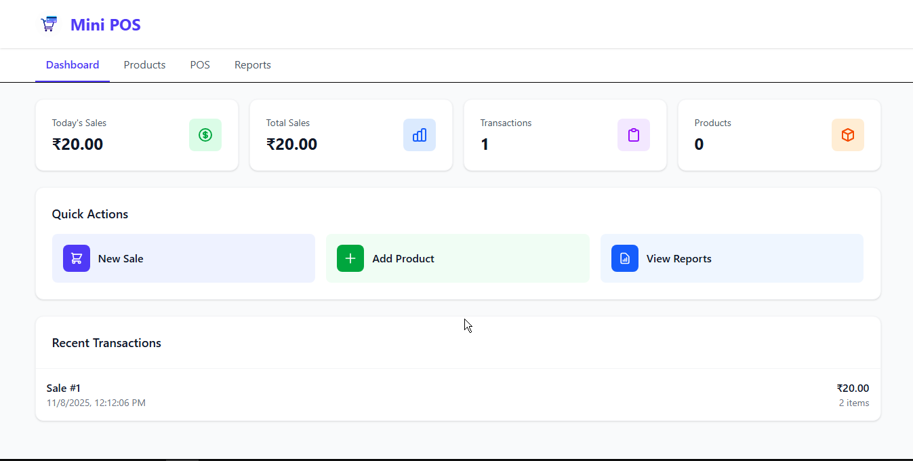
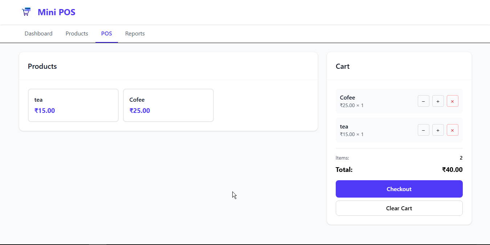
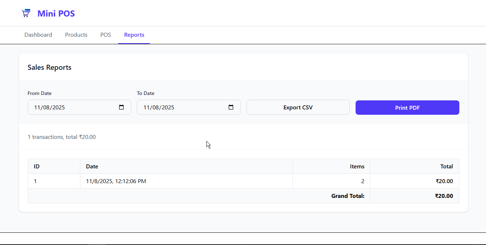

# Mini POS System

A clean, modern, and lightweight Point of Sale application built with **Vanilla JavaScript** and **Tailwind CSS**, designed for small businesses, personal projects, and portfolio showcases. This project emphasizes simplicity, speed, and expressive UI design.

<div align="center">

[](https://tailwindcss.com)
[](https://developer.mozilla.org/en-US/docs/Web/JavaScript)
[](LICENSE)

[Live Demo](https://mini-pos-system-ccbs.netlify.app/) • [Portfolio](https://codecraftbysyed-portfolio.vercel.app/)

</div>

---

## Features

* Product inventory management
* Minimal and intuitive POS interface
* Sales reporting and analytics
* Full Indian Rupee (₹) support
* Offline functionality with Service Worker
* Tailwind CSS–powered modern interface
* Branding support (custom logo and name)

---

## Branding: Codecraft by Syed

This build includes custom branding:

* Header and footer display **Codecraft by Syed**
* Round logo stored at `images/logo.svg`
* Easily replaceable (see "Replacing the logo")

---

## Currency: Indian Rupee (₹)

All UI currency indicators use **₹**. Instances of `$` in both HTML and JS are replaced accordingly.

Updated files include:

* `index.html`
* `pos.html`
* `products.html`
* `js/pos.js`
* `js/products.js`
* `js/reports.js`
* `js/dashboard.js`

Note: Currency parsing uses `.slice(1)` to remove the symbol. If switching to a multi-character symbol, update the parse logic.

---

## Screenshots

Placeholder previews are stored in `images/screenshots/`:

* Dashboard — 

* POS / Cart — 

* Product List — 


Replace with real screenshots when available.

---


Update this path based on your deployment or hosting setup.

---

## Local Development

This repo uses locally compiled Tailwind CSS.

Install dependencies:

```bash
npm install
```

Build once:

```bash
npx tailwindcss -i ./src/input.css -o ./css/style.css --minify
```

Watch mode:

```bash
npm run dev
```

Start a local server (e.g., Live Server) and open:

```
http://127.0.0.1:5500/
```

---

## Service Worker Notice

The service worker previously failed when attempting to cache CDN-based Tailwind assets. It now caches only local resources and gracefully handles failures.

If outdated caching appears:

1. Open DevTools
2. Unregister the service worker
3. Hard reload

---

## Replacing the Logo

To customize branding:

1. Replace `images/logo.svg` with your new file.
2. Keep the same filename, or update references in `index.html`, footers, and headers.

Round assets display best due to Tailwind's `rounded-full` styling.

---

## About the Creator

<div align="center">

**Codecraft by Syed**

[Portfolio](https://codecraftbysyed-portfolio.vercel.app/) • LinkedIn • GitHub

Building clean, intuitive, and efficient web tools.

</div>

---

## License

Licensed under the **MIT License**.

<div align="center">

Made by Codecraft by Syed

[Back to top](#mini-pos-system)

</div>


